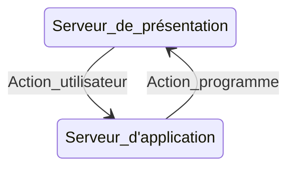
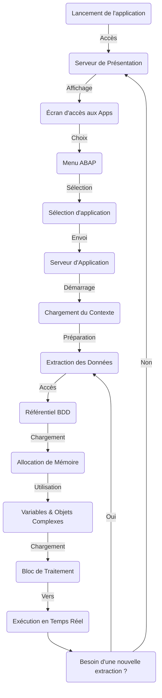

Objectifs :
- Décrire l'architecture SAP NetWeaver Application Server
- Décrire l'éxecution d'un programme de dialogue par le système d'éxecution ABAP

![[Screenshot 2024-07-10 162742.png]]

⇒ Modulaire client / serveur

## Couche architecture:

→ Base de Donnée (plus basse), inlcut programmes + métadonnées ⇒ SGBDR 
→ Serveur d'application (intermédiaire) ⇒ applications SAP + sur mesure
→ Présentation ⇒ interface utilisateur

![[Screenshot 2024-07-10 163633.png]]

## Présentation du flux de programmes

![[Screenshot 2024-07-11 091243.png]]

Pour l'utilisateur moyen SAP ⇒ Boite noire ⇒ s'intéresse uniquement:
- processus de gestion
- saisie
- affichage

Développeur ⇒ doit comprendre serveur ⇔flux de processus

![[Screenshot 2024-07-11 091603.png]]

### Flux de controle:



Details:
	



## ABAP Workbench

Objectifs:
- Décrire la structure du référentiel ABAP
- Utiliser les outils de recherche du référentiel ABAP
- Afficher les objets du référentiel ABAP à l'aide du navigateur d'objets


- **Définition** : Espace central dans SAP où sont stockés tous les objets de développement, comme les programmes, modules de fonctions, et définitions de tables.
- **Contenu** : Comprend des objets livrés par SAP et ceux définis par le client.
- **Indépendance du client** : Les objets du référentiel sont identiques et accessibles depuis n'importe quel client du système SAP.
- **Données spécifiques au client** : Les données d'application et de personnalisation sont propres à chaque mandant et ne sont accessibles qu'à partir de ce mandant.

![[Screenshot 2024-07-11 112751.png]]

### Référentiel ABAP

1. **Définition du Référentiel** :
    
    - Le **référentiel ABAP** est un espace central dans le système SAP où sont stockés tous les **objets de développement**.
    - Ces objets de développement incluent :
        - **Programmes** : Codes ABAP exécutables.
        - **Modules de fonctions** : Blocs de code réutilisables.
        - **Définitions des tables de base de données** : Structures de données utilisées pour stocker les informations dans la base de données.
2. **Contenu du Référentiel** :
    
    - Le référentiel contient à la fois les objets livrés par SAP (comme les programmes standards et les fonctions prédéfinies) et ceux définis par le client (comme les programmes et les personnalisations spécifiques au client).
    - Il est stocké dans la base de données SAP et est **indépendant du client**.
3. **Accessibilité et Indépendance du Client** :
    
    - **Indépendance du client** signifie que les objets dans le référentiel ne sont pas spécifiques à un client particulier. Ils sont accessibles depuis **n'importe quel client** dans le système SAP.
    - Autrement dit, un objet du référentiel est **identique** dans chaque client du système SAP. Il n'y a pas de variations selon le client.
4. **Base de Données : Données d'Application et de Personnalisation** :
5. 
    - En plus des objets du référentiel, la base de données SAP contient aussi :
        - **Données d'application** : Informations spécifiques aux processus métier traités par le système.
        - **Données de personnalisation** : Paramètres et configurations spécifiques au client.
    - Ces données **dépendent du client** et sont organisées par **mandant** (ou client). Cela signifie que chaque enregistrement de données est associé à un mandant spécifique et ne peut généralement être accédé ou modifié que par des utilisateurs connectés à ce mandant particulier.

>Navigation ABAP Objects (referentiel):
>> `SE84`


## Organisation des projets de developpement  ABAP

objectifs :
- Décrire l'infrastructure du développement ABAP
- Créer des packages


a compléter cours de très mauvaise qualité !!!!


### Elaboration de programmes ABAP

Objectifs :
- création de programmes ABAP
- éditeur ABAP
- activation de programmes


/// Revoir les parties précédentes pour prise de note


# Les Groupes de Fonctions en ABAP

En ABAP, un **groupe de fonctions** (Function Group) est une collection logique de modules de fonction (Function Modules) qui partagent des données globales et du code commun. Les groupes de fonctions permettent d'organiser et de structurer le code de manière modulaire et réutilisable. Voici une explication détaillée du principe des groupes de fonctions :

## Structure d'un Groupe de Fonctions

Un groupe de fonctions se compose de plusieurs éléments clés :

- **Modules de fonction (Function Modules)** : Ce sont les unités fonctionnelles du groupe de fonctions. Chaque module de fonction est une procédure pouvant être appelée à partir de n'importe quel programme ABAP. Un module de fonction possède une interface définie, avec des paramètres d'importation, d'exportation, de tables et de changement.

- **Données globales** : Les données globales sont déclarées au niveau du groupe de fonctions et sont accessibles par tous les modules de fonction du groupe. Cela permet de partager des informations entre différents modules de fonction sans avoir besoin de les transmettre explicitement via des paramètres.

- **Sous-programmes (Subroutines)** : Ce sont des blocs de code réutilisables définis à l'intérieur du groupe de fonctions et accessibles par les modules de fonction du même groupe.

## Création et Utilisation des Groupes de Fonctions

### 1. Création d'un Groupe de Fonctions

Pour créer un groupe de fonctions, vous utilisez la transaction `SE37` ou `SE80`. Voici les étapes de base pour créer un groupe de fonctions et des modules de fonction :

- **Créer un groupe de fonctions** : Utilisez la transaction `SE37` ou `SE80`, puis choisissez "Créer un groupe de fonctions". Donnez un nom à votre groupe de fonctions (généralement préfixé par "Z" ou "Y" pour indiquer qu'il s'agit d'une création personnalisée).

- **Ajouter des modules de fonction** : Une fois le groupe de fonctions créé, vous pouvez ajouter des modules de fonction en utilisant l'option "Créer un module de fonction" dans la transaction `SE37`.

### 2. Exemple de Création d'un Groupe de Fonctions

Supposons que nous voulons créer un groupe de fonctions pour gérer des opérations sur des clients.

- **Créer le groupe de fonctions** : `Z_CUSTOMER_FUNCTION_GROUP`
  - Utilisez la transaction `SE37` ou `SE80`.
  - Créez un nouveau groupe de fonctions avec le nom `Z_CUSTOMER_FUNCTION_GROUP`.

- **Ajouter un module de fonction** : `Z_GET_CUSTOMER_NAME`

  ```abap
  FUNCTION Z_GET_CUSTOMER_NAME.
  * Interface
    IMPORTING
      VALUE(ID) TYPE KUNNR
    EXPORTING
      VALUE(NAME) TYPE NAME1.

  * Implementation
    SELECT SINGLE NAME1 INTO NAME
      FROM KNA1
      WHERE KUNNR = ID.

    IF sy-subrc <> 0.
      NAME = 'Customer Not Found'.
    ENDIF.
  ENDFUNCTION.
  ```

- **Ajouter un autre module de fonction** : `Z_UPDATE_CUSTOMER_NAME`

  ```abap
  FUNCTION Z_UPDATE_CUSTOMER_NAME.
  * Interface
    IMPORTING
      VALUE(ID) TYPE KUNNR
      VALUE(NEW_NAME) TYPE NAME1.

  * Implementation
    UPDATE KNA1 SET NAME1 = NEW_NAME
      WHERE KUNNR = ID.

    IF sy-subrc = 0.
      COMMIT WORK.
    ELSE.
      ROLLBACK WORK.
    ENDIF.
  ENDFUNCTION.
  ```

### 3. Utilisation des Modules de Fonction

Vous pouvez appeler les modules de fonction à partir de n'importe quel programme ABAP en utilisant l'instruction `CALL FUNCTION`.

```abap
DATA: lv_name TYPE name1,
      lv_id   TYPE kunnr VALUE '0000123456'.

CALL FUNCTION 'Z_GET_CUSTOMER_NAME'
  EXPORTING
    id   = lv_id
  IMPORTING
    name = lv_name.

WRITE: / 'Customer Name:', lv_name.
```

## Avantages des Groupes de Fonctions

- **Modularité** : Les groupes de fonctions permettent de diviser les fonctionnalités complexes en modules de fonction plus petits et plus gérables.
- **Réutilisabilité** : Les modules de fonction peuvent être réutilisés dans différents programmes, ce qui réduit la duplication du code.
- **Partage de données globales** : Les données globales peuvent être partagées entre les modules de fonction, simplifiant ainsi la gestion des informations communes.

## Conclusion

Les groupes de fonctions en ABAP offrent une manière structurée et modulaire d'organiser le code. En regroupant des modules de fonction liés logiquement et en partageant des données globales, ils permettent de créer des applications plus maintenables et réutilisables.


Voici un résumé concis des **fonctions** et **subroutines** en ABAP :

### Subroutines

- **Définition** : Blocs de code définis une fois, pouvant être appelés plusieurs fois dans un programme.
- **Syntaxe** :
  ```abap
  FORM nom_de_la_subroutine [USING param1] [CHANGING param2] [TABLES table].
    " Instructions ABAP
  ENDFORM.
  ```
- **Appel** :
  ```abap
  PERFORM nom_de_la_subroutine [USING valeur1] [CHANGING valeur2] [TABLES table].
  ```
- **Caractéristiques** :
  - **Pas de valeur de retour directe**.
  - Utilise des paramètres **`USING`** (entrée), **`CHANGING`** (modifiables), et **`TABLES`** (tableaux).
  - Permet de structurer le code en blocs réutilisables.

### Fonctions

- **Définition** : Blocs de code qui peuvent retourner une valeur directement.
- **Syntaxe** :
  ```abap
  FUNCTION nom_de_la_fonction.
    " Instructions ABAP
    RETURNING VALUE(resultat) TYPE type.
  ENDFUNCTION.
  ```
- **Appel** :
  ```abap
  DATA(resultat) = CALL FUNCTION 'nom_de_la_fonction'.
  ```
- **Caractéristiques** :
  - **Retourne une valeur** directement.
  - Peut avoir des paramètres d'entrée et de sortie, mais la valeur de retour est obtenue via une variable.

### Comparaison

- **Subroutines** : Utilisées pour exécuter des blocs de code sans retourner directement une valeur. Les résultats sont passés à travers des paramètres.
- **Fonctions** : Utilisées pour obtenir une valeur de retour directement, facilitant les calculs et les traitements nécessitant un résultat spécifique.


